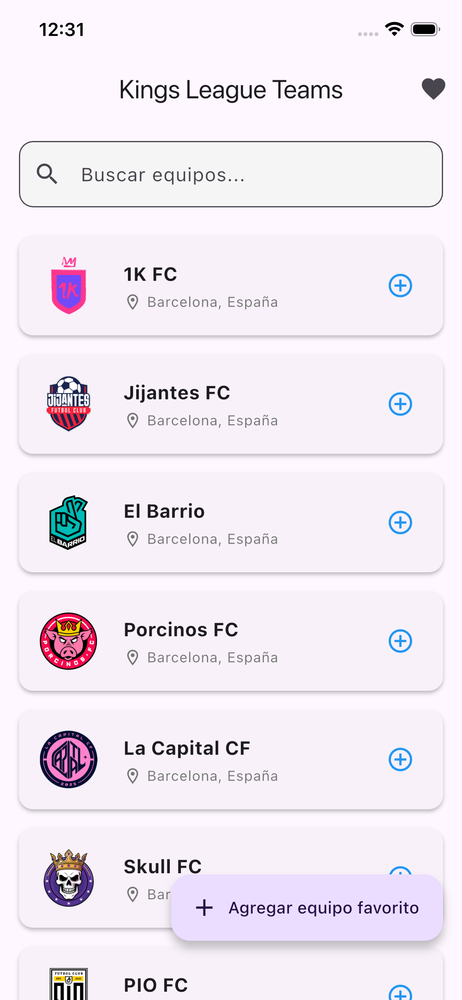
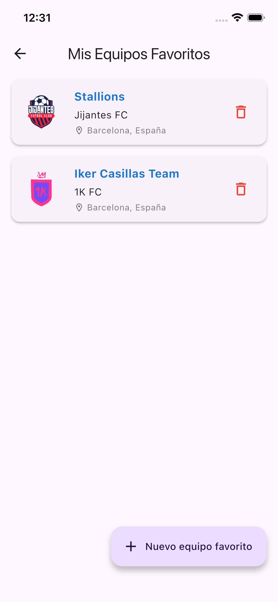
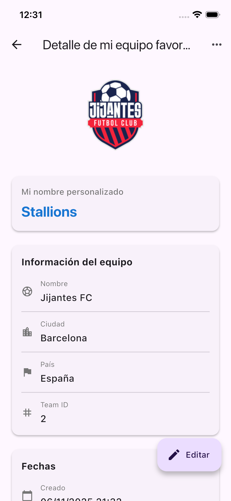
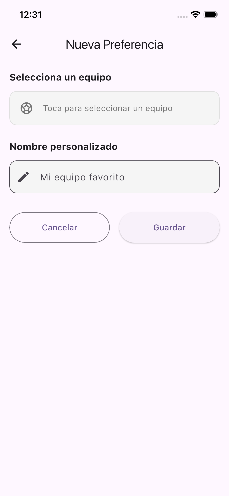
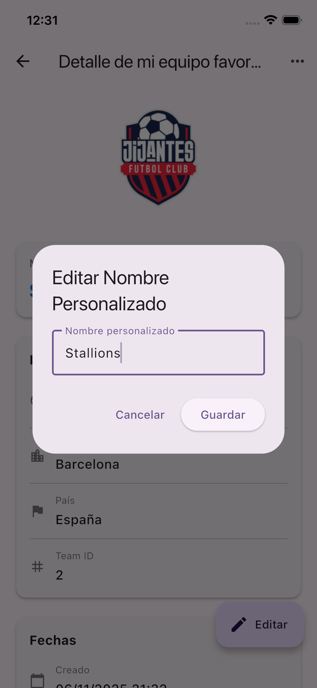

# Kings League Teams Manager

Una aplicación móvil desarrollada en Flutter que permite gestionar equipos de la Kings League, consultando información desde una API pública y guardando preferencias personalizadas localmente.

## Descripción del Proyecto

Esta aplicación permite a los usuarios:
- Consultar y explorar equipos de la Kings League desde una API pública
- Buscar equipos en tiempo real por nombre, ciudad o país
- Guardar equipos favoritos con nombres personalizados
- Gestionar preferencias locales (crear, editar, eliminar)
- Visualizar información detallada de cada equipo

## Capturas de Pantallas







## Arquitectura

El proyecto implementa **Clean Architecture** con las siguientes capas:

```
lib/
├── core/                      # Utilidades y configuración global
│   ├── constants/            # Constantes de la aplicación
│   ├── errors/               # Manejo de errores y excepciones
│   ├── injection/            # Inyección de dependencias
│   └── router/               # Configuración de rutas
├── data/                      # Capa de datos
│   ├── datasources/          # Fuentes de datos (API y Local)
│   ├── models/               # Modelos con serialización
│   └── repositories/         # Implementaciones de repositorios
├── domain/                    # Capa de dominio (lógica de negocio)
│   ├── entities/             # Entidades puras
│   └── repositories/         # Interfaces de repositorios
└── presentation/              # Capa de presentación (UI)
    ├── cubits/               # Gestión de estado con Cubit
    ├── pages/                # Pantallas de la aplicación
    └── widgets/              # Widgets reutilizables
```

## Tecnologías y Paquetes

### Principales
- **Flutter SDK**: 3.0.0+
- **Dart SDK**: 3.0.0+

### Gestión de Estado
- `flutter_bloc: ^8.1.3` - Patrón BLoC/Cubit
- `equatable: ^2.0.5` - Comparación de objetos

### Persistencia Local
- `hive: ^2.2.3` - Base de datos local NoSQL
- `hive_flutter: ^1.1.0` - Integración con Flutter

### Networking
- `http: ^1.1.0` - Cliente HTTP para consumo de API

### Navegación
- `go_router: ^17.0.0` - Navegación declarativa

### UI/UX
- `cached_network_image: ^3.3.0` - Caché de imágenes
- `flutter_svg: ^2.0.9` - Soporte para SVG

### Utilidades
- `get_it: ^7.6.4` - Inyección de dependencias
- `dartz: ^0.10.1` - Programación funcional
- `uuid: ^4.2.2` - Generación de IDs únicos
- `intl: ^0.19.0` - Internacionalización y formato de fechas

### Desarrollo
- `build_runner: ^2.4.6` - Generación de código
- `hive_generator: ^2.0.1` - Generación de adaptadores Hive

## Requisitos Previos

- Flutter SDK 3.0.0 o superior
- Dart SDK 3.0.0 o superior
- Android Studio / VS Code con plugins de Flutter
- Emulador Android / iOS o dispositivo físico

## Instalación

### 1. Clonar el repositorio

```bash
git clone https://github.com/tu-usuario/kings_league_app.git
cd kings_league_app
```

### 2. Instalar dependencias

```bash
flutter pub get
```

### 3. Generar código necesario (Hive adapters)

```bash
flutter pub run build_runner build --delete-conflicting-outputs
```

### 4. Verificar instalación de Flutter

```bash
flutter doctor
```

Asegúrate de que no haya errores críticos.

## ▶ Ejecución

### Modo Debug

```bash
flutter run
```

### Modo Release

```bash
flutter run --release
```

### Seleccionar dispositivo específico

```bash
# Listar dispositivos disponibles
flutter devices

# Ejecutar en dispositivo específico
flutter run -d <device-id>
```

## Pruebas

### Ejecutar todas las pruebas

```bash
flutter test
```

### Ejecutar con cobertura

```bash
flutter test --coverage
```

## Estructura Detallada del Proyecto

```
kings_league_app/
│
├── lib/
│   ├── core/
│   │   ├── constants/
│   │   │   └── api_constants.dart          # URLs y configuración de API
│   │   ├── errors/
│   │   │   ├── exceptions.dart             # Excepciones personalizadas
│   │   │   └── failures.dart               # Clases de fallos
│   │   ├── injection/
│   │   │   └── injection_container.dart    # Configuración de GetIt
│   │   └── router/
│   │       └── app_router.dart             # Configuración de rutas
│   │
│   ├── data/
│   │   ├── datasources/
│   │   │   ├── team_remote_datasource.dart       # Consumo de API
│   │   │   └── preference_local_datasource.dart  # Operaciones Hive
│   │   ├── models/
│   │   │   ├── team_model.dart             # Modelo Team con JSON
│   │   │   ├── preference_model.dart       # Modelo Preference con Hive
│   │   │   └── api_response_model.dart     # Modelo respuesta API
│   │   └── repositories/
│   │       ├── team_repository_impl.dart         # Implementación TeamRepository
│   │       └── preference_repository_impl.dart   # Implementación PreferenceRepository
│   │
│   ├── domain/
│   │   ├── entities/
│   │   │   ├── team.dart                   # Entidad Team
│   │   │   └── preference.dart             # Entidad Preference
│   │   └── repositories/
│   │       ├── team_repository.dart        # Interfaz TeamRepository
│   │       └── preference_repository.dart  # Interfaz PreferenceRepository
│   │
│   ├── presentation/
│   │   ├── cubits/
│   │   │   ├── api_cubit/
│   │   │   │   ├── api_cubit.dart          # Lógica de estado API
│   │   │   │   └── api_state.dart          # Estados de API
│   │   │   └── preference_cubit/
│   │   │       ├── preference_cubit.dart   # Lógica de estado Preferences
│   │   │       └── preference_state.dart   # Estados de Preferences
│   │   ├── pages/
│   │   │   ├── api_list/
│   │   │   │   └── api_list_page.dart      # Pantalla lista de equipos
│   │   │   ├── preferences/
│   │   │   │   ├── preferences_list_page.dart   # Lista de preferencias
│   │   │   │   └── preference_form_page.dart    # Formulario nueva preferencia
│   │   │   └── team_detail/
│   │   │       └── team_detail_page.dart   # Detalle de preferencia
│   │   └── widgets/
│   │       ├── common/
│   │       │   ├── loading_widget.dart     # Widget de carga
│   │       │   ├── error_widget.dart       # Widget de error
│   │       │   └── empty_state_widget.dart # Widget estado vacío
│   │       └── team_card/
│   │           └── team_card.dart          # Card de equipo
│   │
│   └── main.dart                           # Punto de entrada
│
├── pubspec.yaml                            # Dependencias del proyecto
└── README.md                               # Este archivo
```

## 🎯 Funcionalidades Implementadas

### 1. Lista de Equipos (`/api-list`)
- Consulta de equipos desde API de Kings League
- Búsqueda en tiempo real por nombre
- Vista detallada de equipo en diálogo
- Agregar equipo a favoritos directamente
- Manejo de estados: loading, success, error
- Botón de reintentar en caso de error

### 2. Nueva Preferencia (`/prefs/new`)
- Selector de equipo con lista filtrable
- Campo de nombre personalizado con validación
- Verificación de duplicados
- Guardado en base de datos local
- Feedback visual de operaciones

### 3. Lista de Preferencias (`/prefs`)
- Listado de preferencias guardadas
- Visualización de logo y datos básicos
- Eliminación con confirmación
- Pull-to-refresh
- Estado vacío con mensaje informativo
- Navegación a detalle

### 4. Detalle de Preferencia (`/prefs/:id`)
- Información completa del equipo
- Edición de nombre personalizado
- Eliminación con confirmación
- Fechas de creación y actualización
- Imagen destacada del equipo

## API Utilizada

**Endpoint**: `https://api.golazokings.com/teams`

**Respuesta**:
```json
{
  "success": true,
  "statusCode": 200,
  "message": "Request completed successfully",
  "data": [
    {
      "id": 1,
      "name": "Porcinos FC",
      "logoUrl": "https://...",
      "city": "Barcelona",
      "country": "España",
      ...
    }
  ]
}
```

## Configuración Adicional

### Cambiar URL de API

Edita `lib/core/constants/api_constants.dart`:

```dart
class ApiConstants {
  static const String baseUrl = 'https://tu-api.com';
  static const String teamsEndpoint = '/teams';
}
```

### Modificar tema de la aplicación

Edita `lib/main.dart`:

```dart
theme: ThemeData(
  colorScheme: ColorScheme.fromSeed(seedColor: Colors.blue),
  useMaterial3: true,
),
```

## Notas Importantes

1. **Primera ejecución**: La primera vez que ejecutes la app, se descargarán los equipos desde la API.

2. **Persistencia**: Los datos de preferencias se guardan localmente con Hive y persisten entre sesiones.

3. **Conexión a Internet**: Se requiere conexión para cargar los equipos. Las preferencias funcionan offline.

4. **Generación de código**: Si modificas `preference_model.dart`, ejecuta:
   ```bash
   flutter pub run build_runner build --delete-conflicting-outputs
   ```

## 🐛 Solución de Problemas

### Error: "MissingPluginException"
```bash
flutter clean
flutter pub get
flutter run
```

### Error al generar código Hive
```bash
flutter pub run build_runner clean
flutter pub run build_runner build --delete-conflicting-outputs
```

### Error de dependencias
```bash
flutter pub upgrade
flutter pub get
```

## Autor

Desarrollado como parte de una prueba técnica de Flutter.
